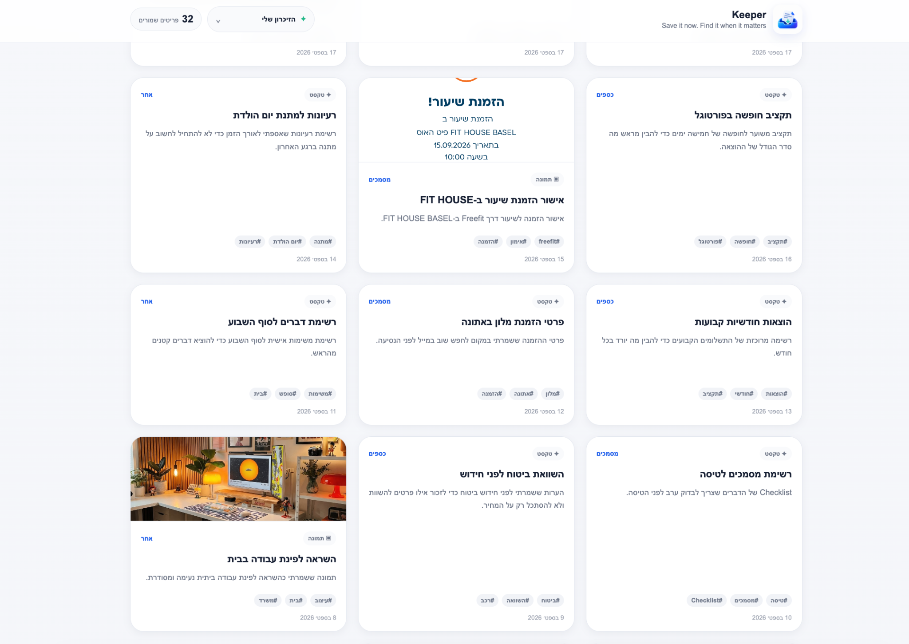
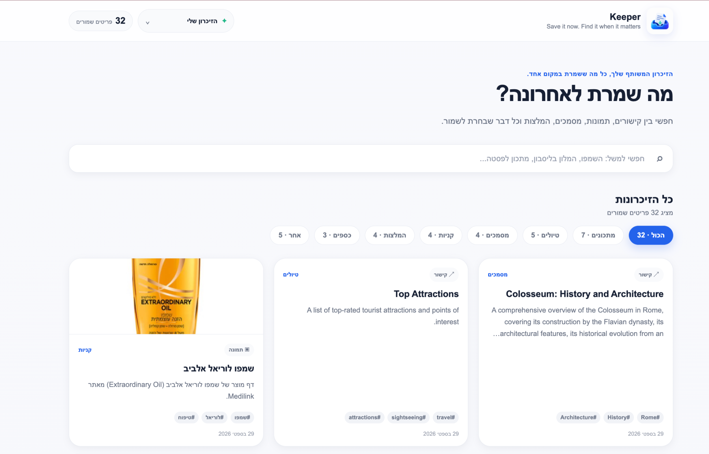
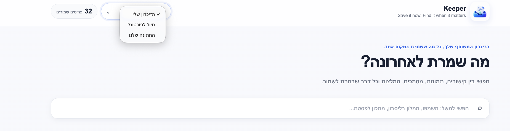
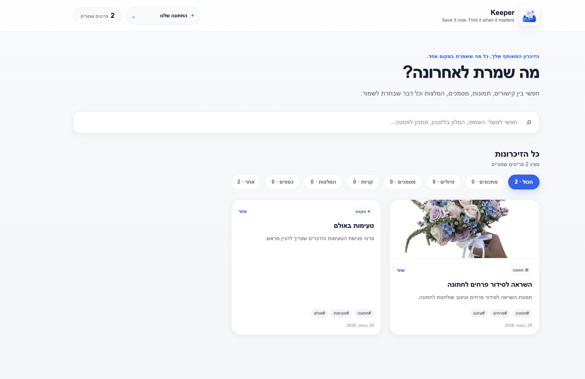
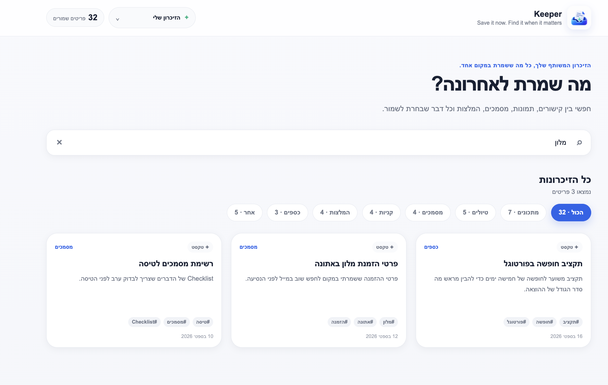
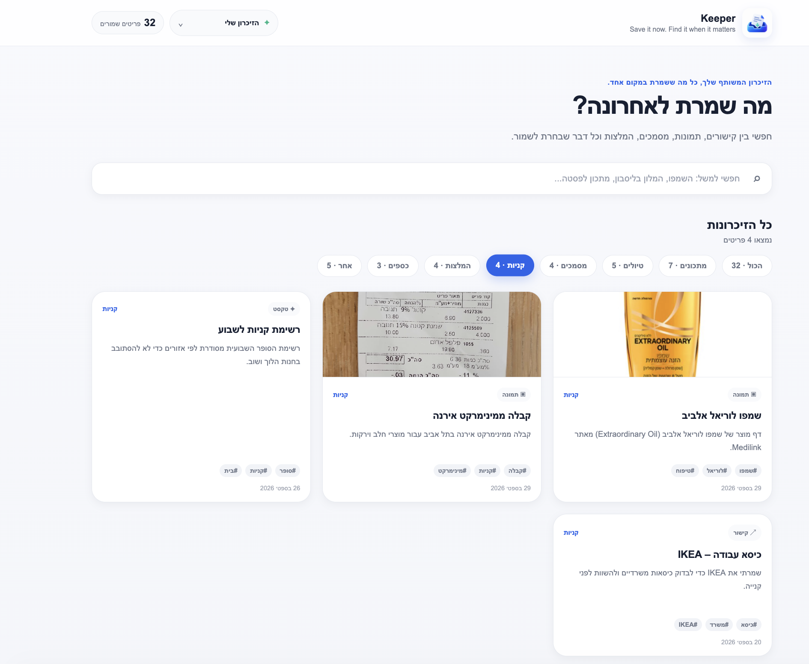
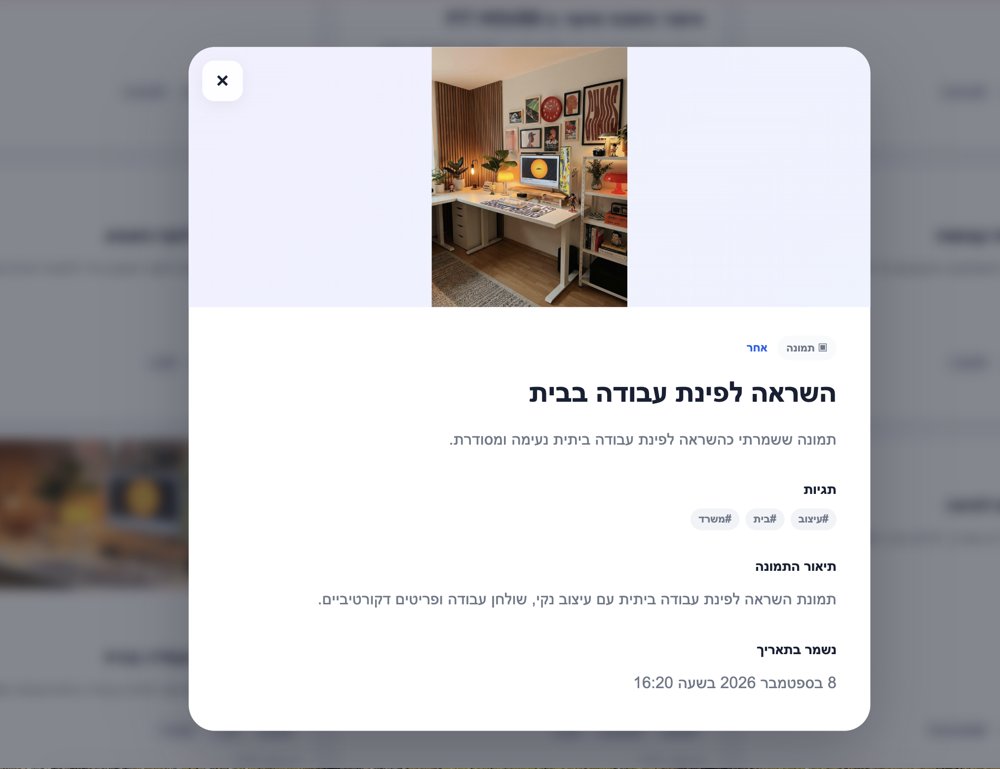

  

<h2 align="center">Keeper - AI-Powered Shared Memory for Saving and Retrieving Everyday Information</h2>

  <strong>Gaia Eldad and Ori Weiss</strong>

## 1. Introduction

### 1.1 Problem & Motivation

In everyday life, people constantly come across useful information they want to keep: recipes, receipts, links, recommendations, images, screenshots, and more. This information is often scattered across chats, bookmarks, screenshots, notes, and messages, so finding it later is difficult. Users frequently do not remember where something was saved, or the exact wording, date, or format needed to locate it. Traditional organization methods require manual effort, such as adding titles, categories, tags, and folders. The problem becomes harder when the same information is shared between multiple people, because each person may store it in a different place and none of them may remember exactly how it was written.

### 1.2 Project Goal & System Overview

Keeper is an intelligent shared-memory assistant that lets multiple users save and retrieve everyday information with minimal effort. WhatsApp was chosen as the main interface because it is already familiar, accessible, and part of users' daily communication, so it requires no new interaction habits. Users send text, URLs, and images, and the system processes and organizes them automatically. The resulting shared memory supports semantic search, direct retrieval of specific items, and RAG-based answers over the stored knowledge. Shared memory spaces allow several users to contribute to and retrieve information from the same collection, and a web dashboard provides an additional way to browse and view that shared memory.

## 2. System Specification

### 2.1 User Interaction Overview

- **Saving information** — Users send content through WhatsApp and receive a confirmation once it has been saved.
- **Retrieving information** — Users can request a specific item using a natural-language message.
- **Asking the memory** — Broader questions can be answered using relevant information already stored in the shared memory.
- **Shared interaction** — Multiple users can contribute to and retrieve information from the same memory space.
- **Separate memory spaces** — Users can create different spaces, with saving and retrieval organized within the currently active space
- **Browsing stored content** — The web dashboard provides an additional visual interface for exploring the saved information.

### 2.2 High-Level System Flow

The system supports two main interaction flows: saving new information and retrieving or asking questions over previously stored information.

  

## 3. Implementation

### 3.1 Technology Choices & External Services

- **Python + FastAPI** — Backend development, webhook handling, and integration with AI and external services.
- **Supabase** — Combines PostgreSQL, `pgvector` semantic search, and image storage in one platform.
- **Gemini** — Used for intent classification, content enrichment, embeddings, image understanding, and RAG-based answer generation.
- **WhatsApp Cloud API** — Provides the main communication interface between users and the system.
- **ngrok** — Used during development to expose the local FastAPI webhook endpoint to the WhatsApp Cloud API.
- **HTML, CSS & JavaScript** — Used to build the web dashboard for browsing stored information.

### 3.2 WhatsApp Integration & Message Handling

The WhatsApp Cloud API serves as the main communication interface, with FastAPI handling incoming webhook events.

- **Message identification** — Each message is associated with the relevant user and active shared space.
- **Direct handling** — Commands and media types are detected and handled directly.
- **Intent classification** — Gemini distinguishes between SAVE and SEARCH requests, with rule-based heuristics as a fallback.
- **Routing** — The request is forwarded to the corresponding ingestion or retrieval pipeline.
- **Response** — The result is returned to the user through WhatsApp.

### 3.3 Information Ingestion & Storage

Each SAVE request follows a type-specific processing flow before being normalized into a common memory-item structure.

- **Input detection & routing** — The incoming message type is identified first. Text messages are checked for URLs, while regular text is passed through intent classification before entering the SAVE pipeline.
- **Text** — Gemini generates a title, summary, category, and tags from the original message.
- **URLs** — The page is fetched, cleaned from irrelevant HTML elements, and reduced to its main content before metadata generation.
- **Images** — Gemini Vision generates a visual description and extracts visible text, while the original image is uploaded to Supabase Storage.
- **Unified representation** — The original or extracted content and generated metadata are combined into a common searchable representation for all content types.
- **Embedding & storage** — The representation is encoded as a 768-dimensional document embedding and stored with the structured item data in Supabase and the active space.

#### Save Pipeline

  

### 3.4 Semantic Search, Retrieval & RAG

Keeper uses semantic search as the basis of retrieval, so users can search by meaning rather than exact keyword matches.

#### Semantic Search & Direct Retrieval

An earlier text-matching approach was too limited, because relevant information could be missed when the user phrased the request differently from the saved content. A user may search for a shakshuka recipe, for example, without using the exact wording stored in the item.

Keeper solves this with embeddings. When an item is saved, its searchable representation is converted into a vector embedding and stored in Supabase. At search time, the query is converted into an embedding with the same model, and pgvector compares it with the stored embeddings in the active space.

Results are ranked by semantic similarity. Results below the `0.62` threshold are rejected, and source-type hints can prioritize text, URL, or image results.

Direct Retrieval is used when the user asks for a specific saved item. Keeper returns the highest-scoring relevant original item directly, without generating a new answer.

#### What is RAG?

Retrieval-Augmented Generation (RAG) combines information retrieval with a generative language model. Relevant information is first retrieved from an external knowledge source and then provided as context for answer generation.

#### RAG in Keeper

Keeper uses RAG for broader questions rather than requests for a specific saved item. It first performs the same semantic retrieval process, selects up to three relevant stored items, builds context from them, and sends that context together with the user question to Gemini. The answer is therefore grounded in information stored in Keeper.

Direct Retrieval returns the original item itself. RAG uses the retrieved items only as evidence for a generated answer.

#### Search & Retrieval Flow

1. **Query preparation** — The search query is extracted, the preferred source type (text, URL, image, or none) is inferred, and the system decides whether the request requires Direct Retrieval or RAG.
2. **Query embedding & candidate retrieval** — A 768-dimensional query embedding is generated and used to perform vector search in the active space.
3. **Ranking & filtering** — Candidates are ranked by similarity, source-type filtering is applied when relevant, and results below `0.62` are rejected.
4. **Direct retrieval** — For specific-item requests, the original text, URL, or image of the highest-scoring relevant item is returned.
5. **RAG retrieval** — For broader questions, up to three relevant items are kept, context is built from them, and that context is passed to Gemini for a grounded answer.
6. **Fallback handling** — A not-found response is returned when no relevant item exists. If RAG generation fails, the system falls back to the best retrieved result.

#### Search & RAG Pipeline

  

#### Similarity Threshold Example

For each search query, Keeper compares the query embedding with the embeddings of stored items. Results with a similarity score below `0.62` are rejected.

Stored item: **"Wedding flower arrangement inspiration"**

| Query | Similarity | Decision |
|---|---:|---|
| `תמונה של זר ` | 0.525 | Rejected |
| `תמונת זר הפרחים לכלה` | 0.652 | Retrieved |
| `השראה לסידור פרחים לחתונה` | 0.673 | Retrieved |

This threshold prevents the system from returning the closest result when the semantic match is still too weak.

### 3.5 Shared Spaces & Multi-User Memory

Shared spaces allow multiple users to contribute to and retrieve information from the same memory while keeping different spaces isolated from one another.

#### Data Model

- **Users and spaces** — The shared-memory model is implemented in Supabase using `app_users`, `spaces`, and `space_members`.
- **Many-to-many membership** — `space_members` connects users and spaces, allowing each user to belong to multiple spaces and each space to contain multiple members.
- **Membership roles** — Each membership stores a role such as `owner` or `member`.
- **Space-scoped items** — Every stored item is associated with a `space_id`, so the memory belongs to the space rather than only to the user who originally saved it.

#### Space Context & Access Control

- **Active space** — Each user has an `active_space_id`, which defines the context used for SAVE and SEARCH operations.
- **Membership validation** — Before accessing or switching to a space, the backend verifies that the user is a member of that space.
- **Scoped retrieval** — Storage and semantic-search queries are filtered by `space_id`, ensuring that information from one space is not returned while the user is working in another.
- **Shared retrieval** — Because members of the same space operate on the same collection of items, information saved by one member can later be retrieved by another.

#### Space Management

- **Invite codes** — Each space receives a unique invite code that can be shared with other users.
- **Joining a space** — When a user joins with `/join <code>`, the backend resolves the invite code, creates the membership if needed, and sets that space as active.
- **Switching spaces** — `/switch <code>` changes the active space only after membership has been validated.
- **WhatsApp interface** — Space-management operations are exposed to users through simple commands sent directly in the chat.

#### User Commands

| User Command | Purpose |
|---|---|
| `/space` | Show the currently active space |
| `/spaces` | List all spaces the user belongs to |
| `/create <name>` | Create a new shared space |
| `/invite` | Show the invite code of the active space |
| `/join <code>` | Join a space using its invite code |
| `/switch <code>` | Switch the active space |

### 3.6 Web Dashboard

The Web Dashboard provides a web-based view of the same shared memory used through WhatsApp, while reusing the existing backend, data model, and access-control logic.

#### Dashboard Access & Authentication

- **Access from WhatsApp** — The `/dashboard` command generates a personal dashboard URL for the requesting user.
- **Signed token** — The URL contains a signed, time-limited token that represents the user identity without requiring a separate login flow.
- **Token validation** — Before serving user-specific data, the FastAPI backend verifies the token signature and expiration to ensure that it has not been modified or expired.

#### API & Data Flow

- **Client-server architecture** — The dashboard frontend is implemented with HTML, CSS, and JavaScript and communicates with the FastAPI backend through dedicated API endpoints.
- **Space retrieval** — The frontend requests the list of spaces available to the authenticated user and uses it to populate the space selector.
- **Item retrieval** — When a space is selected, its `space_id` is sent to the backend, which retrieves the corresponding stored items from Supabase.
- **Shared data source** — Both WhatsApp and the dashboard operate on the same items stored in Supabase, so information saved through WhatsApp is available through the web interface as well.

#### Authorization & Space Isolation

- **Membership validation** — The backend verifies that the authenticated user belongs to the requested space before returning its items.
- **Protected image access** — Stored images are retrieved through a backend endpoint that validates both the user token and space membership before downloading the image from Supabase Storage.
- **Server-side enforcement** — Access restrictions are enforced by the backend rather than relying only on the frontend, preventing users from requesting data from spaces they do not belong to.

#### Frontend Interaction

- **Space navigation** — Users can switch between their available spaces through the dashboard selector, which reloads the items for the selected `space_id`.
- **Structured browsing** — Titles, summaries, categories, tags, and source types generated during ingestion are used to organize and display the stored items.
- **Local filtering** — Search and category filters are applied in the frontend to the items already loaded for the selected space.
- **Item details** — Individual items can be opened to display their original content, metadata, links, or stored images.

### 3.7 Technical Design Choices & Iterative Refinement

Several implementation choices were refined through testing and comparison of alternatives. This led to explicit technical decisions across the embedding, retrieval, RAG, reliability, and access-control layers.

- **Embedding Dimensionality & Search Representation** — We tested a higher-dimensional embedding configuration before choosing 768 dimensions as a better balance between retrieval quality, vector-storage size, and similarity-computation cost in `pgvector`. We also found that retrieval quality depended strongly on the embedded content itself, so each representation combines the title, category, tags, summary, and original or extracted content rather than relying on raw text alone.

- **Prompt Engineering & Hallucination Control** — The prompts were iteratively refined through testing to make AI outputs more stable and predictable. We added stricter JSON structures, controlled categories and tags, language-preservation rules, and explicit grounding instructions to reduce malformed outputs and prevent the model from introducing information that was not supported by the stored memory.

- **Deterministic Processing & Imperfect LLM Output** — We deliberately avoided using the LLM for decisions that can be made reliably in code. Commands and recognizable URLs are handled deterministically, while Gemini is reserved for ambiguous natural-language input, with rule-based fallback when classification fails. AI outputs are also validated and cleaned before entering the pipeline to handle formatting deviations such as unexpected Markdown around JSON.

- **Candidate Retrieval, Ranking & Similarity Threshold** — A simple semantic-search implementation could return the single nearest vector, but the nearest stored item is not necessarily relevant enough to answer the user's request. We therefore retrieve a candidate set first, then apply source-type refinement and similarity evaluation before selecting the final result. Direct retrieval considers up to 10 candidates, and an application-level `MIN_SIMILARITY` threshold of `0.62` rejects weak matches instead of forcing the system to return something simply because it is mathematically closest.

- **Bounded & Source-Aware RAG Context** — We chose to keep the RAG context small and focused, using at most three relevant items rather than passing every retrieved result to Gemini. This reduces context noise and prevents weaker matches from influencing the generated answer. The context is also built according to source type, so each item contributes the information most useful for reasoning: original text, extracted webpage content, or image description and visible text.

- **Bounded Retries & Idempotent Webhook Processing** — Testing showed that temporary external-service failures and repeated webhook deliveries had to be handled explicitly rather than treated as rare edge cases. We therefore refined the flow to retry transient Gemini Vision failures with bounded exponential backoff, while WhatsApp messages are processed idempotently by checking each message identifier before processing to prevent duplicate memory items.

## 4. Demonstration

The following examples demonstrate the main user flows of Keeper through WhatsApp, including multi-format ingestion, semantic retrieval, RAG-based answers, shared spaces, and dashboard access.

These examples show end-to-end handling of text, image, and URL content, including saving, semantic retrieval, and grounded answers.

  
  
  

  
  

When no sufficiently relevant item exists in the active memory, Keeper returns a not-found response instead of generating unsupported information.

  

Shared spaces can be created, joined, and switched directly from WhatsApp, while SAVE and SEARCH remain isolated to the currently active space.

  
  
  

The `/dashboard` command provides the user with a personal signed link that opens the dashboard directly without requiring a separate login flow.

  

The dashboard provides a structured view of the selected memory space, presenting stored text, URLs, and images together with the metadata generated during ingestion.

  
  

Users can navigate between the memory spaces they belong to, with the dashboard loading only the items associated with the selected space.

  

  

Stored information can be narrowed through free-text search and category-based filtering, allowing users to quickly locate relevant items within the selected space.

  
  

Opening an item reveals its original content together with the structured metadata generated during processing, such as its summary, category, tags, image description, and save date.

  

## 5. Future Work

Future development could extend Keeper in several directions:

- **Additional content types** — Support documents such as PDFs and Word files, as well as voice messages through automatic transcription before entering the existing ingestion pipeline.
- **Improved shared-space management** — Provide a richer and more user-friendly interface for creating, renaming, leaving, and managing spaces and their members instead of relying mainly on chat commands.
- **Roles & permissions** — Expand the existing `owner` / `member` model with more granular permissions for actions such as inviting users, removing members, editing shared content, or managing a space.
- **Editing & deletion** — Allow users to update or remove previously stored information through WhatsApp or the dashboard.
- **Improved retrieval & ranking** — Explore techniques such as hybrid search and reranking to improve retrieval quality when several items are semantically similar.
- **AI model evaluation** — Compare alternative AI and embedding models for tasks such as intent classification, content enrichment, image understanding, semantic search, and RAG generation, evaluating trade-offs between retrieval quality, response accuracy, latency, reliability, and cost.
- **Production-ready deployment & authentication** — Move from the development ngrok setup to a permanent deployment and introduce a more complete dashboard authentication and session flow.

## 6. Summary & Conclusions

Keeper demonstrates how a familiar messaging interface can be extended into a structured, multimodal memory system through the combination of semantic retrieval, RAG, and shared data management. A key engineering insight from the project was that reliable retrieval requires more than simply adding embeddings or an LLM: the final system combines enriched semantic representations, candidate filtering, relevance thresholds, source-aware context construction, and deterministic logic where AI is unnecessary. The implementation was refined through repeated testing of retrieval quality, model behavior, external-service failures, and multi-user flows, leading to a system that is both more accurate and more predictable.