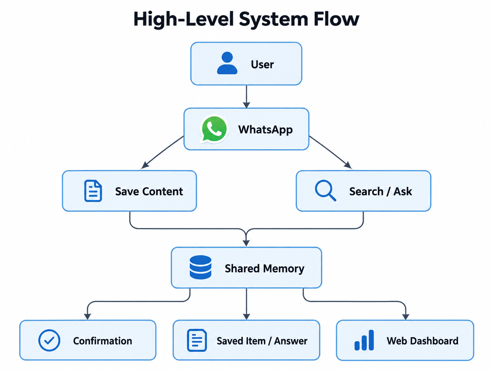
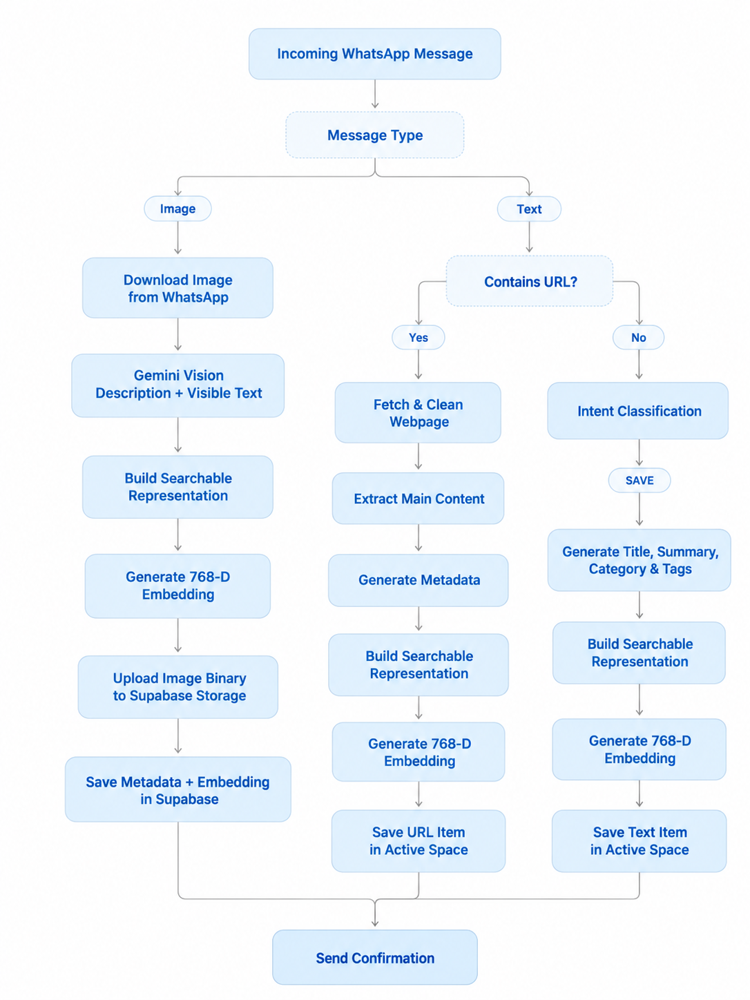
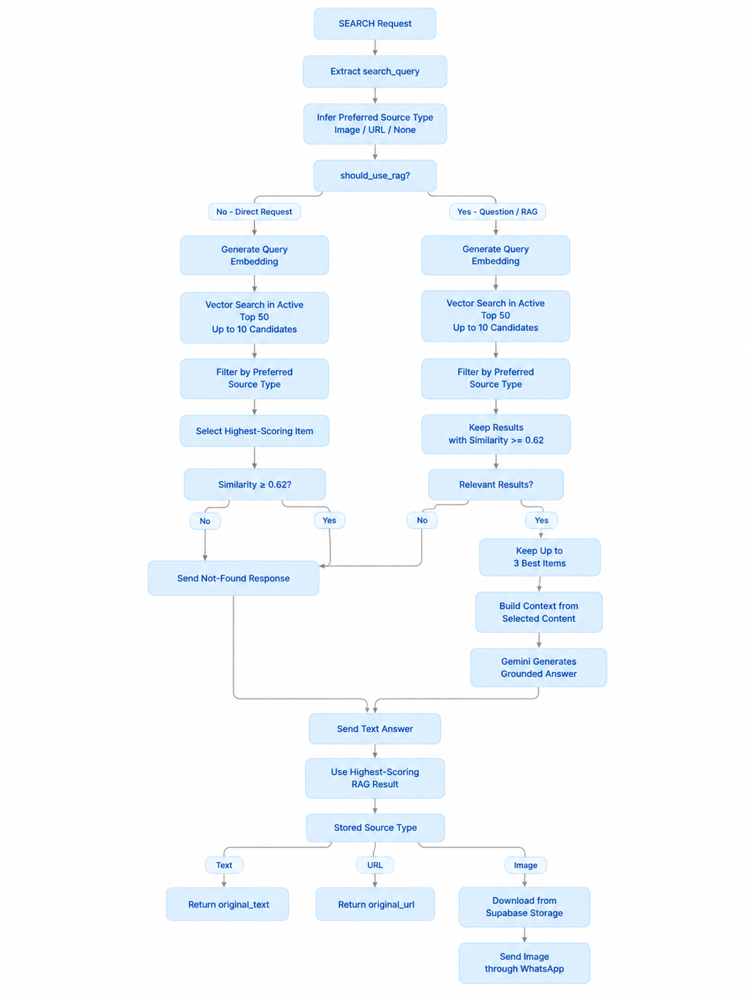
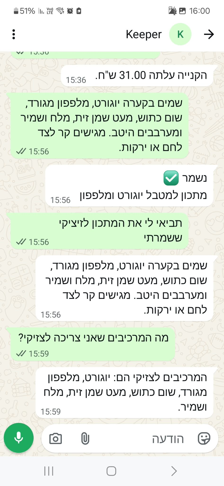
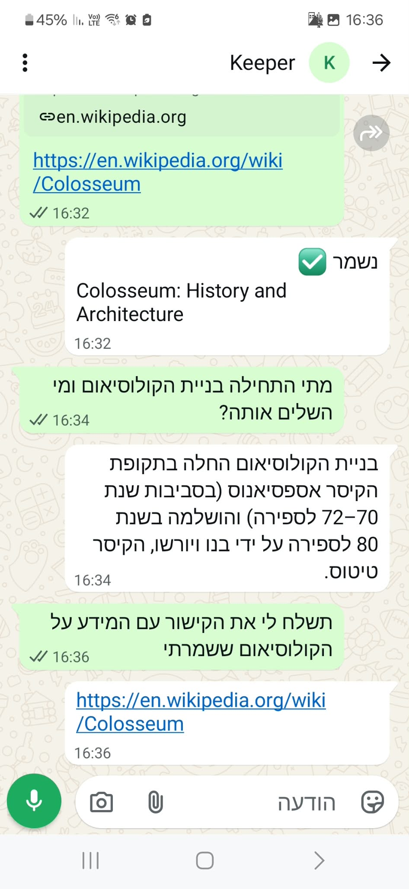
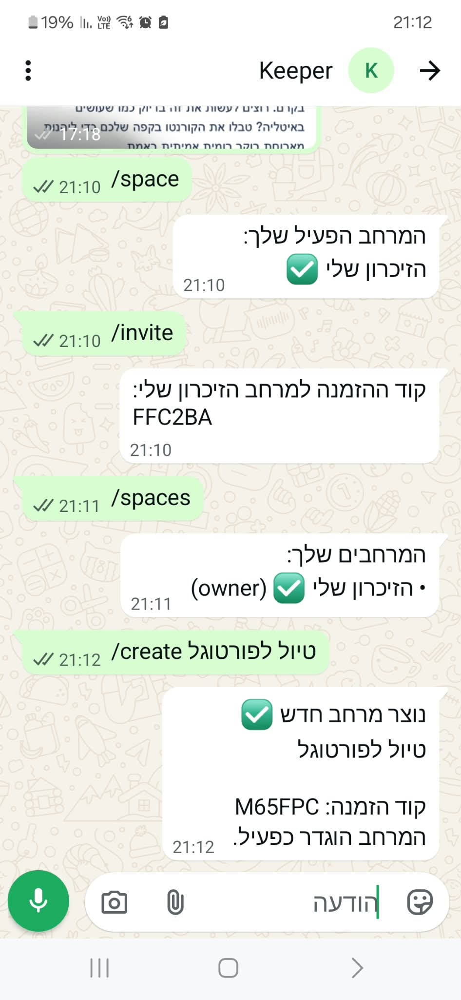
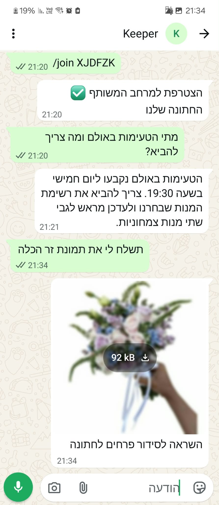
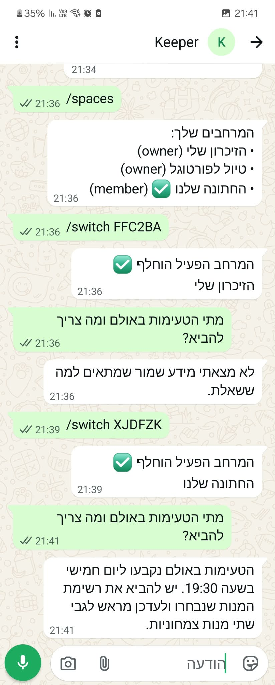
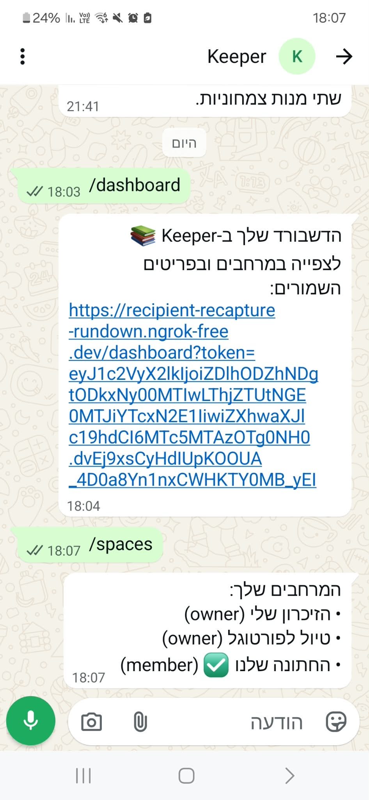

  

<h2 align="center">Keeper - AI-Powered Shared Memory for Saving and Retrieving Everyday Information</h2>

  <strong>Gaia Eldad and Ori Weiss</strong>

## 1. Introduction

### 1.1 Problem & Motivation

In everyday life, people constantly come across useful information they want to keep: recipes, receipts, links, recommendations, images, screenshots, and more. However, this information is often scattered across chats and messages, making it difficult to find later, especially when users do not remember the exact wording, date, or format. Our goal was to create a more natural way to build a digital memory using WhatsApp as the main interface, since it is already part of our everyday communication and requires no new interaction habits. Instead of manually adding titles, categories, tags, or organizing content, users can simply send text, a link, or an image, and the system processes and organizes it automatically. Search is based on meaning rather than exact keyword matching, allowing users to ask naturally, for example, *“Where is the recipe with mushrooms that we saved?”* or *“Show me the receipt from the restaurant.”* The system also supports shared memory spaces, allowing multiple users to contribute to and retrieve information from the same shared collection.

### 1.2 Project Goal & System Overview

The goal of the project is to build an intelligent shared-memory assistant that allows multiple users to save and retrieve different types of information with minimal effort. Users interact mainly through WhatsApp, where text, URLs, and images are processed into a shared memory that supports semantic search, direct retrieval of specific items, and RAG-based answers over the stored knowledge. A web dashboard provides an additional way to browse and view the shared memory.

## 2. System Specification

### 2.1 User Interaction Overview

- **Saving information** — Users send content through WhatsApp and receive a confirmation once it has been saved.
- **Retrieving information** — Users can request a specific item using a natural-language message.
- **Asking the memory** — Broader questions can be answered using relevant information already stored in the shared memory.
- **Shared interaction** — Multiple users can contribute to and retrieve information from the same memory space.
- **Separate memory spaces** — Users can create different spaces, with saving and retrieval organized within the currently active space
- **Browsing stored content** — The web dashboard provides an additional visual interface for exploring the saved information.

### 2.2 High-Level System Flow

The system supports two main interaction flows: saving new information and retrieving or asking questions over previously stored information.

  

## 3. Implementation

### 3.1 Technology Choices & External Services

- **Python + FastAPI** — Backend development, webhook handling, and integration with AI and external services.
- **Supabase** — Combines PostgreSQL, `pgvector` semantic search, and image storage in one platform.
- **Gemini** — Used for intent classification, content enrichment, embeddings, image understanding, and RAG-based answer generation.
- **WhatsApp Cloud API** — Provides the main communication interface between users and the system.
- **ngrok** — Used during development to expose the local FastAPI webhook endpoint to the WhatsApp Cloud API.
- **HTML, CSS & JavaScript** — Used to build the web dashboard for browsing stored information.

### 3.2 WhatsApp Integration & Message Handling

The WhatsApp Cloud API serves as the main communication interface, with FastAPI handling incoming webhook events.

- **Message identification** — Each message is associated with the relevant user and active shared space.
- **Direct handling** — Commands and media types are detected and handled directly.
- **Intent classification** — Gemini distinguishes between SAVE and SEARCH requests, with rule-based heuristics as a fallback.
- **Routing** — The request is forwarded to the corresponding ingestion or retrieval pipeline.
- **Response** — The result is returned to the user through WhatsApp.

### 3.3 Information Ingestion & Storage

Each SAVE request follows a type-specific processing flow before being normalized into a common memory-item structure.

- **Input detection & routing** — The incoming message type is identified first. Text messages are checked for URLs, while regular text is passed through intent classification before entering the SAVE pipeline.
- **Text** — Gemini generates a title, summary, category, and tags from the original message.
- **URLs** — The page is fetched, cleaned from irrelevant HTML elements, and reduced to its main content before metadata generation.
- **Images** — Gemini Vision generates a visual description and extracts visible text, while the original image is uploaded to Supabase Storage.
- **Unified representation** — The original or extracted content and generated metadata are combined into a common searchable representation for all content types.
- **Embedding & storage** — The representation is encoded as a 768-dimensional document embedding and stored with the structured item data in Supabase and the active space.

#### Save Pipeline

  

### 3.4 Semantic Search, Retrieval & RAG

SEARCH requests pass through a semantic retrieval pipeline that determines both what information is relevant and how it should be returned.

#### RAG in Keeper

Retrieval-Augmented Generation (RAG) combines semantic retrieval with language generation. Instead of asking Gemini to answer from its general knowledge, Keeper first retrieves the most relevant items from the active memory space and provides only those items as context for the model. Semantic search finds the relevant evidence, while RAG is used when a broader question requires interpreting or combining that evidence. Requests for a specific item bypass generation and return the original stored source.

1. **Query preparation** — The search query is extracted, the preferred source type (text, URL, image, or none) is inferred, and the system determines whether the request requires direct retrieval or RAG.
2. **Query embedding & candidate retrieval** — A 768-dimensional query embedding is generated and used to perform vector search in the active space, producing a set of candidate items.
3. **Ranking & filtering** — The candidates are ranked by similarity score, filtered by preferred source type when relevant, and results below the `0.62` relevance threshold are rejected.
4. **Direct retrieval** — For a specific-item request, the highest-scoring relevant item is selected and its original text, URL, or image is returned.
5. **RAG retrieval** — For broader questions, the system keeps up to three of the best relevant items, builds a context from their saved content, and passes it to Gemini to generate a grounded answer.
6. **Fallback handling** — If no relevant result is found, the system returns a not-found response; if answer generation fails, the best retrieved result can still be used instead of failing the entire request.

#### Search & RAG Pipeline

  

#### Similarity Threshold Example

For each search query, Keeper compares the query embedding with the embeddings of stored items. Results with a similarity score below `0.62` are rejected.

Stored item: **"Wedding flower arrangement inspiration"**

| Query | Similarity | Decision |
|---|---:|---|
| `תמונה של זר ` | 0.525 | Rejected |
| `תמונת זר הפרחים לכלה` | 0.652 | Retrieved |
| `תמונת הפרחים לחתונה` | 0.622 | Retrieved |

This threshold prevents the system from returning the closest result when the semantic match is still too weak.

### 3.6 Shared Spaces & Multi-User Memory

Shared memory is implemented through `app_users`, `spaces`, and `space_members`, allowing users to participate in multiple shared memory spaces while keeping each space isolated from the others.

- **Multiple space membership** — A user may belong to multiple spaces, with a role such as `owner` or `member`.
- **Active space context** — Each user has an `active_space_id`, which determines the space used for SAVE and SEARCH operations.
- **Scoped storage and retrieval** — New items are saved only to the active space, and semantic search is restricted to items stored in that same space.
- **Shared access** — Members of the same space can save information and retrieve items that were added by other members.
- **Space isolation** — Information from one space is not returned when the user is working in another space.
- **Invite-based membership** — Each space has a unique invite code that can be shared with other users.
- **Space management through WhatsApp** — Users can create, join, list, inspect, and switch between spaces directly from the chat.

| Command | Purpose |
|---|---|
| `/space` | Show the currently active space |
| `/spaces` | List all spaces the user belongs to |
| `/create <name>` | Create a new shared space |
| `/invite` | Show the invite code of the active space |
| `/join <code>` | Join a space using its invite code |
| `/switch <code>` | Switch the active space |

### 3.6 Web Dashboard

The Web Dashboard provides a structured web view of the same shared memory used through WhatsApp.

- **Direct access from WhatsApp** — The `/dashboard` command generates a personal, signed link that identifies the user and opens the dashboard directly.
- **Shared backend & access control** — The dashboard uses FastAPI endpoints to read data from Supabase, while the backend validates the signed token and verifies that the user is a member of each requested space.
- **Space navigation** — Users can switch between the spaces they belong to and view the stored information in each space separately.
- **Structured browsing** — Processed metadata generated during ingestion, including titles, summaries, categories, and tags, is used to organize, search, and filter stored items.
- **Item access** — Users can open individual items to view their original content, generated metadata, links, or stored images.

### 3.7 Technical Design Choices & Iterative Refinement

Several implementation choices were refined through testing and comparison of alternatives. This led to explicit technical decisions across the embedding, retrieval, RAG, reliability, and access-control layers.

- **Embedding Dimensionality & Search Representation** — We tested a higher-dimensional embedding configuration before choosing 768 dimensions as a better balance between retrieval quality, vector-storage size, and similarity-computation cost in `pgvector`. We also found that retrieval quality depended strongly on the embedded content itself, so each representation combines the title, category, tags, summary, and original or extracted content rather than relying on raw text alone.

- **Prompt Engineering & Hallucination Control** — The prompts were iteratively refined through testing to make AI outputs more stable and predictable. We added stricter JSON structures, controlled categories and tags, language-preservation rules, and explicit grounding instructions to reduce malformed outputs and prevent the model from introducing information that was not supported by the stored memory.

- **Deterministic Processing & Imperfect LLM Output** — We deliberately avoided using the LLM for decisions that can be made reliably in code. Commands and recognizable URLs are handled deterministically, while Gemini is reserved for ambiguous natural-language input, with rule-based fallback when classification fails. AI outputs are also validated and cleaned before entering the pipeline to handle formatting deviations such as unexpected Markdown around JSON.

- **Candidate Retrieval, Ranking & Similarity Threshold** — A simple semantic-search implementation could return the single nearest vector, but the nearest stored item is not necessarily relevant enough to answer the user's request. We therefore retrieve a candidate set first, then apply source-type refinement and similarity evaluation before selecting the final result. Direct retrieval considers up to 10 candidates, and an application-level `MIN_SIMILARITY` threshold of `0.62` rejects weak matches instead of forcing the system to return something simply because it is mathematically closest.

- **Bounded & Source-Aware RAG Context** — We chose to keep the RAG context small and focused, using at most three relevant items rather than passing every retrieved result to Gemini. This reduces context noise and prevents weaker matches from influencing the generated answer. The context is also built according to source type, so each item contributes the information most useful for reasoning: original text, extracted webpage content, or image description and visible text.

- **Bounded Retries & Idempotent Webhook Processing** — Testing showed that temporary external-service failures and repeated webhook deliveries had to be handled explicitly rather than treated as rare edge cases. We therefore refined the flow to retry transient Gemini Vision failures with bounded exponential backoff, while WhatsApp messages are processed idempotently by checking each message identifier before processing to prevent duplicate memory items.

## 4. Demonstration

The following examples demonstrate the main user flows of Keeper through WhatsApp, including multi-format ingestion, semantic retrieval, RAG-based answers, shared spaces, and dashboard access.

These examples show end-to-end handling of text, image, and URL content, including saving, semantic retrieval, and grounded answers.

  
  
  

  
  

When no sufficiently relevant item exists in the active memory, Keeper returns a not-found response instead of generating unsupported information.

  

Shared spaces can be created, joined, and switched directly from WhatsApp, while SAVE and SEARCH remain isolated to the currently active space.

  
  
  

The `/dashboard` command generates a signed link that allows the user to open the web dashboard directly from WhatsApp.

  

## 5. Conclusion

Keeper demonstrates how a familiar messaging interface can be extended into a structured, multimodal memory system through the combination of semantic retrieval, RAG, and shared data management. A key engineering insight from the project was that reliable retrieval requires more than simply adding embeddings or an LLM: the final system combines enriched semantic representations, candidate filtering, relevance thresholds, source-aware context construction, and deterministic logic where AI is unnecessary. The implementation was refined through repeated testing of retrieval quality, model behavior, external-service failures, and multi-user flows, leading to a system that is both more accurate and more predictable. Future work could further improve retrieval ranking, expand supported content types, and add richer context-aware interactions across shared spaces.