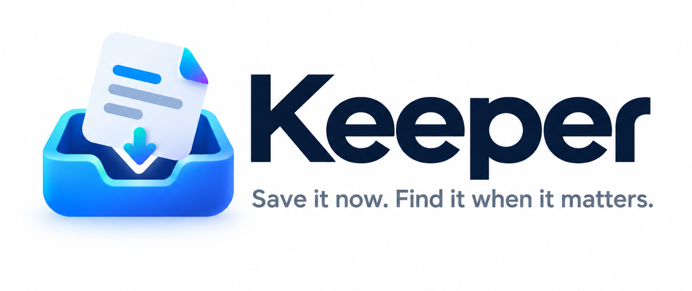
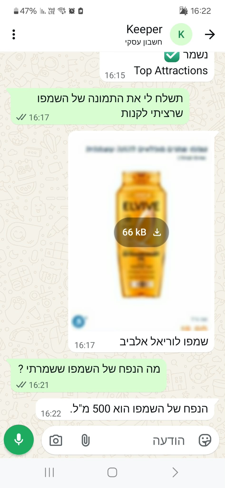
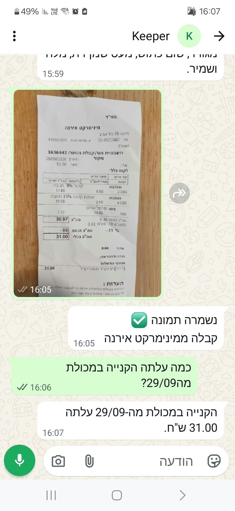
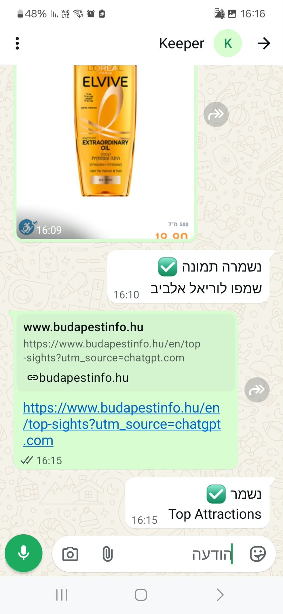
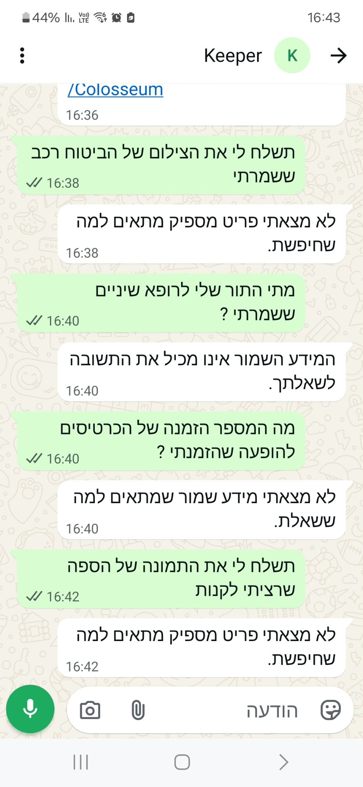

<p align="center">
  
</p>

<h2 align="center">Keeper - AI-Powered Shared Memory for Saving and Retrieving Everyday Information</h2>

<p align="center">
  <strong>Gaia Eldad and Ori Weiss</strong>
</p>

### 1.1 Problem & Motivation

In everyday life, people constantly come across useful information they want to keep: recipes, receipts, links, recommendations, images, screenshots, and more. However, this information is often scattered across chats and messages, making it difficult to find later, especially when users do not remember the exact wording, date, or format. Our goal was to create a more natural way to build a digital memory using **WhatsApp as the main interface**, since it is already part of our everyday communication and requires no new interaction habits. Instead of manually adding titles, categories, tags, or organizing content, users can simply send text, a link, or an image, and the system processes and organizes it automatically. Search is based on meaning rather than exact keyword matching, allowing users to ask naturally, for example, *“Where is the recipe with mushrooms that we saved?”* or *“Show me the receipt from the restaurant.”* The system also supports **shared memory spaces**, allowing multiple users to contribute to and retrieve information from the same shared collection.

### 1.2 Project Goal & System Overview

The goal of the project is to build an intelligent shared-memory assistant that allows multiple users to save and retrieve different types of information with minimal effort. Users interact mainly through WhatsApp, where text, URLs, and images are processed into a shared memory that supports semantic search, direct retrieval of specific items, and RAG-based answers over the stored knowledge. A web dashboard provides an additional way to browse and view the shared memory.

## 2. System Specification

### 2.1 User Interaction Overview

- **Saving information** — Users send content through WhatsApp and receive a confirmation once it has been saved.
- **Retrieving information** — Users can request a specific item using a natural-language message.
- **Asking the memory** — Broader questions can be answered using relevant information already stored in the shared memory.
- **Shared interaction** — Multiple users can contribute to and retrieve information from the same memory space.
- **Browsing stored content** — The web dashboard provides an additional visual interface for exploring the saved information.

### 2.2 High-Level System Flow

The system supports two main interaction flows: saving new information and retrieving or asking questions over previously stored information.

```text
                         User
                          │
                       WhatsApp
                      /        \
                     /          \
              Save Content    Search / Ask
                   │               │
                   └───────┬───────┘
                           ▼
                     Shared Memory
                    /      |       \
                   ▼       ▼        ▼
        Confirmation   Saved Item   Web Dashboard
                          / Answer
                          
```

### 3.2 Technology Choices

- **Python + FastAPI** — Backend development, webhooks, and straightforward integration with AI and external services.
- **Supabase** — Combines PostgreSQL, `pgvector` semantic search, and image storage in one platform.
- **Gemini** — Used for intent classification, content enrichment, embeddings, image understanding, and RAG-based answer generation.
- **WhatsApp Cloud API** — Provides a familiar and natural interface for everyday user interaction.
- **HTML, CSS & JavaScript** — Used to build the web dashboard for browsing stored information.

### 3.3 WhatsApp Integration & Message Handling

The WhatsApp Cloud API serves as the system’s communication interface, while FastAPI exposes the webhook that receives and parses incoming events. Each message is associated with the relevant user and active shared space; commands and media types are handled directly, while Gemini-based intent classification distinguishes between SAVE and SEARCH requests, with rule-based heuristics as a fallback. The request is then routed to the relevant pipeline, and the response is returned through WhatsApp.

### 3.4 Information Ingestion & Storage

Each SAVE request follows a type-specific processing pipeline before being normalized into a common memory-item structure. Text is enriched with a title, summary, category, and tags; URLs are fetched and cleaned to extract their main content; and images are analyzed with Gemini Vision to generate a description and extract visible text. The content and generated metadata are combined into a unified searchable representation, encoded as a 768-dimensional document embedding, and stored with the item data in Supabase. Image binaries are stored separately in Supabase Storage.

### 3.5 Semantic Search, Retrieval & RAG

For a SEARCH request, the query is converted into a 768-dimensional query embedding and compared against stored document embeddings using vector similarity. Candidate items are ranked by similarity score, and results below a minimum relevance threshold are rejected. Deterministic signals, such as terms indicating a link or image, can further prefer the requested content type. Specific-item requests use direct retrieval, while broader questions retrieve multiple relevant items and pass them to Gemini as context for a RAG-based answer.

### 3.6 Shared Spaces & Multi-User Memory

Shared memory is implemented through `app_users`, `spaces`, and `space_members`, with each user also storing an `active_space_id`. A user may belong to multiple spaces, but SAVE and SEARCH operations are always scoped to the currently active space, so retrieval is limited to the relevant shared memory rather than the entire database. Users can join a space using `/join <invite_code>`, which creates the membership and sets that space as active.

### 3.7 Engineering Decisions & Iterative Improvements

Several parts of the implementation were refined after testing exposed concrete failure cases. Duplicate WhatsApp events were handled by checking `source_message_id` before processing, while keeping the database uniqueness constraint to prevent duplicate memory items. URL extraction was improved by removing non-content HTML elements and prioritizing the main article content before generating embeddings. Retrieval was extended with type-aware rules after semantic similarity alone occasionally returned the correct topic but the wrong source type. In addition, Gemini `429/503` failures led us to add rule-based intent fallbacks and basic URL metadata extraction, allowing core flows to continue even when AI enrichment was temporarily unavailable.

### 3.8 Web Dashboard

The web dashboard provides a secondary interface for viewing the shared memory accumulated through WhatsApp. Although users only submit the raw content, the ingestion pipeline enriches each item with structured metadata such as titles, categories, summaries, and tags, allowing the dashboard to automatically organize the stored information without manual classification. The dashboard reads these structured items from Supabase and supports browsing, text search, category filtering, and detailed item views over the same shared memory.

## 4. Demonstration

The following examples demonstrate the main user flows of the system through WhatsApp, including saving different content types, retrieving the original stored content, and asking broader questions using RAG.

<p align="center">
  
  
  
</p>

<p align="center">
  
  
</p>

The system answers only from information stored in the shared memory. If no relevant information is found, it returns an appropriate response instead of inventing an answer.

<p align="center">
  
</p>


## 5. Conclusion

The project demonstrated how a simple messaging interface can be extended into a structured shared-memory system through careful separation between ingestion, storage, retrieval, and generation. One of the main engineering insights was that using a unified semantic representation made the system easier to extend across different content types, while combining deterministic logic with AI improved efficiency, reliability, and control over the retrieval flow. The iterative development process also showed the value of refining the architecture based on real failure cases rather than relying on a purely AI-driven solution.

Future work could expand shared-space management, improve retrieval and ranking, and support additional content types and richer context-aware interactions.